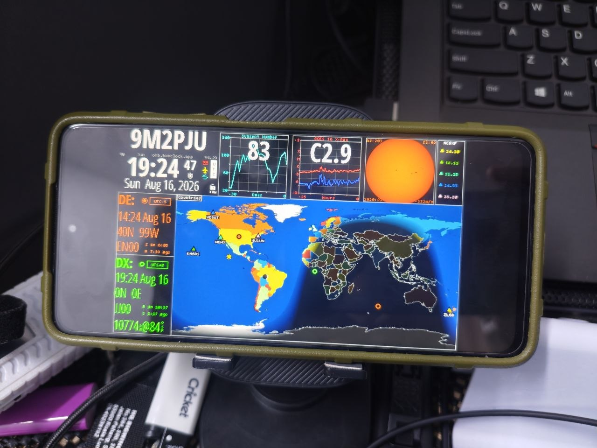

# 📱 HamClock for Android Installation Guide

**9M2PJU HamClock (Open HamClock - OHB Edition)** can run on any **Android phone, tablet, or TV box (Android 5.0+)**. 

Repurposing an old or spare Android tablet makes one of the **cheapest, lowest-power (<3W), and most responsive dedicated HamClock touch dashboards** for your amateur radio shack!

<p align="center">
  
</p>

---

## ⚡ Choose Your Installation Method

| Method | Best For | Requirements | Setup Complexity |
| :--- | :--- | :--- | :--- |
| [**Method 1: Official Android App (.apk)**](#-method-1-official-standalone-android-app-apk-recommended) ⭐ | **Most Users** | Android 5.0+ | 🟢 1-Click Install (No CLI) |
| [**Method 2: Termux &amp; Fully Kiosk**](#-method-2-termux--fully-kiosk-browser-diy--command-line) | **Power Users &amp; CLI Fans** | Termux (F-Droid) | 🟡 1-Line Script |

---

## 📥 Method 1: Official Standalone Android App (.apk) [Recommended]

The official **9M2PJU HamClock Android App** is a standalone, full-featured native application with an embedded C++ engine. No Termux, Linux chroot, or root permissions required!

### 📦 Download Latest Release

Download the latest APK directly from [**GitHub Releases**](https://github.com/9M2PJU/9M2PJU-HamClock-Android-Releases/releases):

- [📥 **Download Universal APK (`9M2PJU-HamClock.apk`)**](https://github.com/9M2PJU/9M2PJU-HamClock-Android-Releases/releases/latest) *(Recommended — Works on all Android devices)*

#### Architecture-Specific Packages:
- **`9M2PJU-HamClock-arm64-v8a.apk`** — 64-bit ARM (Modern phones & tablets)
- **`9M2PJU-HamClock-armeabi-v7a.apk`** — 32-bit ARM (Older phones & tablets)
- **`9M2PJU-HamClock-x86_64.apk`** — 64-bit x86 (Android x86 PCs & emulators)
- **`9M2PJU-HamClock-x86.apk`** — 32-bit x86 (Older Intel Android devices)

🔗 **All Releases & Source:** [https://github.com/9M2PJU/9M2PJU-HamClock-Android-Releases/releases](https://github.com/9M2PJU/9M2PJU-HamClock-Android-Releases/releases)

---

### ✨ App Highlights & Features

- **🚀 100% Native Embedded C++ Engine**: Runs the full HamClock backend and telemetry pipeline natively on Android.
- **📱 Edge-to-Edge Immersive Fullscreen**: Hardware-accelerated UI that automatically scales to your display with responsive multi-touch controls.
- **🔋 24/7 Shack Station Background Daemon**: Optional foreground service with WakeLock and WifiLock support to keep HamClock running continuously.
- **🌐 Multi-Device Shack / LAN Sharing**: Access the live interactive web mirror from your PC, Mac, or iPad over WiFi at `http://<PHONE-IP>:8081/live.html`.
- **📜 In-App Diagnostic Logs**: Built-in real-time log viewer for network and telemetry diagnostics.
- **🔄 Auto-Start on Boot**: Dedicated toggle to automatically launch HamClock whenever the Android device powers on.

---

### 🛠️ Quick Setup (APK)

1. Download **`9M2PJU-HamClock.apk`** from [GitHub Releases](https://github.com/9M2PJU/9M2PJU-HamClock-Android-Releases/releases).
2. Tap the downloaded file to install (grant permission to *Install Unknown Apps* if prompted).
3. Open **HamClock** from your app drawer.
4. On first launch, tap anywhere on the screen to open the Setup dialog, then enter your **Callsign**, **Grid Square / Lat-Long**, and display preferences.
5. *(Optional)* In app settings, enable **Keep Screen On** and **Auto-Start on Boot** for permanent wall-mounted or desk-mounted operation.

---

## 💻 Method 2: Termux & Fully Kiosk Browser (DIY / Command Line)

### ⚡ 1-Liner Quick Install (Termux)

Open the **Termux** app and paste this single command:

```bash
pkg update -y && pkg install -y curl && bash -c "$(curl -fsSL https://raw.githubusercontent.com/9M2PJU/9M2PJU-HamClock-Installer/main/termux/install.sh)"
```

### 📖 Step-by-Step Setup Walkthrough

#### Step 1: Install Termux
> ⚠️ **Important:** Do **NOT** install Termux from Google Play Store (it is deprecated and unmaintained). Install the latest release from:
- [**F-Droid (Recommended)**](https://f-droid.org/en/packages/com.termux/)
- [**GitHub Releases**](https://github.com/termux/termux-app/releases)

#### Step 2: Run the Installer
Open Termux and run the installer one-liner:
```bash
pkg update -y && pkg install -y curl && bash -c "$(curl -fsSL https://raw.githubusercontent.com/9M2PJU/9M2PJU-HamClock-Installer/main/termux/install.sh)"
```
The script will automatically:
1. Detect Termux on Android.
2. Install `clang`, `make`, `git`, and `curl` via `pkg`.
3. Prompt you for your desired resolution (default: `1600x960` for tablets, or `800x480` for phones).
4. Apply Android Bionic `fdsan` protection.
5. Compile the optimized native ARM binary and install `hamclock` to `$PREFIX/bin/hamclock`.

#### Step 3: Keep Termux Awake & Launch HamClock
1. Prevent Android from suspending Termux:
   ```bash
   termux-wake-lock
   ```
2. **Disable Android Battery Saver**:
   - Go to Android **Settings ➔ Apps ➔ Termux ➔ Battery** and set it to **"Unrestricted"** (or *Don't optimize*).
3. Start the HamClock daemon in the background:
   ```bash
   hamclock -k &
   ```
   *(The `-k` flag skips the setup countdown and boots immediately).*

#### Step 4: Open in Fully Kiosk Browser (Best Full-Screen Experience)

1. Install [**Fully Kiosk Browser & Launcher**](https://play.google.com/store/apps/details?id=de.ozerov.fully&hl=en) from the Google Play Store.
2. In Fully Kiosk Browser settings, set the **Start URL** to:
   ```text
   http://localhost:8081/live.html
   ```
3. Fully Kiosk Browser automatically:
   - Hides Android status bars and navigation buttons for true full screen.
   - Automatically scales the HamClock display to perfectly fit your device screen.
   - Keeps the screen awake for 24/7 continuous shack monitoring.
   - Can optionally autostart on device boot.

---

### 🎯 Direct Non-Interactive Resolution Install

You can bypass the interactive menu by setting `TARGET`:

```bash
# For Tablets & 1080p Screens (Default)
TARGET=1600x960 bash -c "$(curl -fsSL https://raw.githubusercontent.com/9M2PJU/9M2PJU-HamClock-Installer/main/termux/install.sh)"

# For Phones & Compact Screens
TARGET=800x480 bash -c "$(curl -fsSL https://raw.githubusercontent.com/9M2PJU/9M2PJU-HamClock-Installer/main/termux/install.sh)"

# For 2K High-DPI Tablets
TARGET=2400x1440 bash -c "$(curl -fsSL https://raw.githubusercontent.com/9M2PJU/9M2PJU-HamClock-Installer/main/termux/install.sh)"
```

---

## 🔋 24/7 Shack Dashboard Optimizations

For permanent wall-mounted or desk-mounted Android clocks:

### 1. Battery Health & Power Supply
- Keep the device plugged into a 5V 2A+ USB power adapter.
- If your Android build supports **Battery Protect** (limiting max charge to 80%–85%), enable it in Android Settings to preserve battery longevity.

### 2. Fully Kiosk Browser Features
- **Keep Screen On**: Prevents Android from dimming or locking the screen during operation.
- **Auto-Reload on Connection Loss**: Automatically reconnects if the local WiFi restarts.
- **Night Mode / Screen Dimming**: Set scheduled brightness dimming during quiet hours.

---

## 🔄 Autostart on Android Boot (Termux:Boot)

To have HamClock automatically start in the background whenever your Android device reboots:

1. Install the [**Termux:Boot**](https://f-droid.org/en/packages/com.termux.boot/) add-on from F-Droid.
2. Open the Termux:Boot app once to register permissions.
3. Inside Termux, create a boot script:
   ```bash
   mkdir -p ~/.termux/boot
   cat << 'EOF' > ~/.termux/boot/start-hamclock.sh
   #!/data/data/com.termux/files/usr/bin/bash
   termux-wake-lock
   hamclock -k &
   EOF
   chmod +x ~/.termux/boot/start-hamclock.sh
   ```

---

## 🖥️ Advanced: Native X11 Window (via Termux:X11)

If you prefer running HamClock as an X11 window rather than through the web server:

1. Install the companion [**Termux:X11**](https://github.com/termux/termux-x11/releases) app.
2. Inside Termux, install X11 packages:
   ```bash
   pkg install -y x11-repo
   pkg install -y clang make libx11 git
   ```
3. Compile the X11 target:
   ```bash
   ./termux/build.sh hamclock-1600x960
   cp hamclock-1600x960 $PREFIX/bin/hamclock
   ```
4. Start the Termux:X11 server and run:
   ```bash
   export DISPLAY=:0
   hamclock
   ```

---

## 🐧 Advanced: Running via PRoot Linux (Debian / Ubuntu)

If you prefer a standard full Linux distribution inside Termux:

```bash
pkg install -y proot-distro
proot-distro install debian
proot-distro login debian
curl -fsSL https://raw.githubusercontent.com/9M2PJU/9M2PJU-HamClock-Installer/main/install.sh | bash
```

---

<div align="center">

```
73 de 9M2PJU • Enjoy HamClock on Android!
```

</div>
